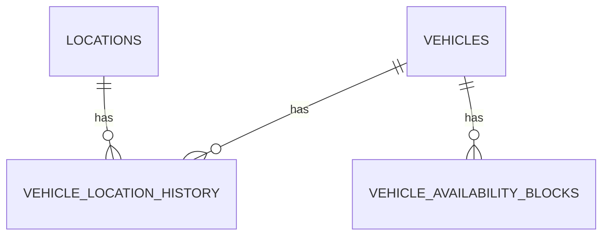

# Database Design - Car Management: Location & Inventory Management

## Table of Contents
- [locations](#locations)
- [vehicle_location_history](#vehicle_location_history)
- [vehicle_availability_blocks](#vehicle_availability_blocks)

## Entity Relationship Diagram

> Note: `VEHICLES` is defined by the Vehicle Onboarding TRD and is shown here only as a reference for relationships. Its full table design is out of scope for this document.

## Tables

### locations

| Field | Data Type | Index | Constraints | Description |
|---|---|---|---|---|
| id | UUID | Primary Key | NOT NULL, DEFAULT gen_random_uuid() | Unique identifier for the location |
| name | TEXT | Index | NOT NULL | Display name of the location (e.g., branch/depot name) |
| address | TEXT | - | NOT NULL | Full address of the location |
| city | TEXT | Index | NOT NULL | City where the location resides |
| status | TEXT | - | NOT NULL, DEFAULT 'active' | Operating status of the location (e.g., active, inactive) |
| created_at | TIMESTAMP WITH TIME ZONE | - | NOT NULL, DEFAULT now() | Record creation timestamp |
| updated_at | TIMESTAMP WITH TIME ZONE | - | NOT NULL, DEFAULT now() | Record last update timestamp |
| deleted_at | TIMESTAMP WITH TIME ZONE | - | NULL | Record deletion timestamp |
| created_by | TEXT | - | NOT NULL | Identifier of the user/system that created the record |
| updated_by | TEXT | - | NOT NULL | Identifier of the user/system that last updated the record |
| deleted | BOOLEAN | - | NOT NULL, DEFAULT false | Soft-delete flag |

### vehicle_location_history

| Field | Data Type | Index | Constraints | Description |
|---|---|---|---|---|
| id | UUID | Primary Key | NOT NULL, DEFAULT gen_random_uuid() | Unique identifier for the history entry |
| vehicle_id | UUID | Index, Foreign Key -> vehicles.id | NOT NULL | Vehicle whose home location changed |
| previous_location_id | UUID | Foreign Key -> locations.id | NULL | Home location before the transfer (NULL for the initial assignment) |
| new_location_id | UUID | Index, Foreign Key -> locations.id | NOT NULL | Home location after the transfer |
| transfer_cost | DECIMAL(15,2) | - | NOT NULL, DEFAULT 0 | Cost incurred by the transfer, always attributed to the company pool |
| transfer_date | TIMESTAMP WITH TIME ZONE | Index | NOT NULL | Date/time the transfer took effect |
| created_at | TIMESTAMP WITH TIME ZONE | - | NOT NULL, DEFAULT now() | Record creation timestamp |
| updated_at | TIMESTAMP WITH TIME ZONE | - | NOT NULL, DEFAULT now() | Record last update timestamp |
| deleted_at | TIMESTAMP WITH TIME ZONE | - | NULL | Record deletion timestamp |
| created_by | TEXT | - | NOT NULL | Identifier of the user/system that created the record |
| updated_by | TEXT | - | NOT NULL | Identifier of the user/system that last updated the record |
| deleted | BOOLEAN | - | NOT NULL, DEFAULT false | Soft-delete flag |

### vehicle_availability_blocks

| Field | Data Type | Index | Constraints | Description |
|---|---|---|---|---|
| id | UUID | Primary Key | NOT NULL, DEFAULT gen_random_uuid() | Unique identifier for the availability block |
| vehicle_id | UUID | Index, Foreign Key -> vehicles.id | NOT NULL | Vehicle affected by the block |
| block_type | TEXT | Index | NOT NULL, CHECK (block_type IN ('reservation', 'maintenance', 'transfer')) | Reason for unavailability |
| reference_id | UUID | - | NULL | Identifier of the related record (e.g., reservation id, maintenance id), if applicable |
| start_at | TIMESTAMP WITH TIME ZONE | Index | NOT NULL | Start of the unavailability window |
| end_at | TIMESTAMP WITH TIME ZONE | Index | NOT NULL | End of the unavailability window |
| created_at | TIMESTAMP WITH TIME ZONE | - | NOT NULL, DEFAULT now() | Record creation timestamp |
| updated_at | TIMESTAMP WITH TIME ZONE | - | NOT NULL, DEFAULT now() | Record last update timestamp |
| deleted_at | TIMESTAMP WITH TIME ZONE | - | NULL | Record deletion timestamp |
| created_by | TEXT | - | NOT NULL | Identifier of the user/system that created the record |
| updated_by | TEXT | - | NOT NULL | Identifier of the user/system that last updated the record |
| deleted | BOOLEAN | - | NOT NULL, DEFAULT false | Soft-delete flag |
