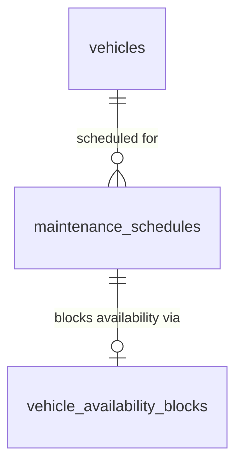

# Database Design - Maintenance & Service Scheduling

## Table of Contents
- [maintenance_schedules](#maintenance_schedules)

## Entity Relationship Diagram

> Note: `vehicles` is defined by the [Database Design - Vehicle Onboarding](./database-design-vehicle-onboarding.md) document, which contains the canonical, consolidated table definition (merged across the Vehicle Onboarding, Location & Inventory Management, Reservation Allocation, and Maintenance & Service Scheduling TRDs). `vehicle_availability_blocks` is defined by the [Database Design - Car Management: Location & Inventory Management](./database-design-car-management-location-inventory.md) document. Both are shown here only as a reference for relationships; their full table designs are out of scope for this document.

## Tables

### maintenance_schedules

| Field | Data Type | Index | Constraint | Description |
| --- | --- | --- | --- | --- |
| id | UUID | Primary Key | NOT NULL, DEFAULT gen_random_uuid() | Unique identifier of the maintenance schedule entry. |
| vehicle_id | UUID | Index, Foreign Key -> vehicles.id | NOT NULL | Vehicle the maintenance is scheduled for. |
| threshold_km | INTEGER | Index | NOT NULL, CHECK (threshold_km > 0 AND threshold_km % 10000 = 0) | The 10,000 km odometer multiple that triggered this maintenance schedule (e.g., 10000, 20000, 30000). |
| odometer_at_scheduling | INTEGER | | NOT NULL, CHECK (odometer_at_scheduling >= threshold_km) | Vehicle's `current_odometer` (see [Database Design - Vehicle Onboarding](./database-design-vehicle-onboarding.md)) at the time the crew scheduled this maintenance. |
| scheduled_start_date | DATE | Index | NOT NULL | First calendar day the vehicle is blocked for maintenance. |
| scheduled_end_date | DATE | Index | NOT NULL, CHECK (scheduled_end_date >= scheduled_start_date) | Last calendar day the vehicle is blocked for maintenance. |
| status | TEXT | Index | NOT NULL, CHECK (status IN ('scheduled', 'completed', 'cancelled')), DEFAULT 'scheduled' | Lifecycle status of this maintenance schedule entry. |
| availability_block_id | UUID | Unique Index, Foreign Key -> vehicle_availability_blocks.id | NULL | The availability block (`block_type = 'maintenance'`) created in [vehicle_availability_blocks](./database-design-car-management-location-inventory.md#vehicle_availability_blocks) to enforce unavailability for `scheduled_start_date`..`scheduled_end_date`. NULL once the schedule is cancelled and its block is removed. |
| completed_at | TIMESTAMP WITH TIME ZONE | | NULL | Timestamp when the maintenance crew marked the schedule as completed. |
| created_at | TIMESTAMP WITH TIME ZONE | | NOT NULL | Record creation timestamp. |
| updated_at | TIMESTAMP WITH TIME ZONE | | NOT NULL | Record last update timestamp. |
| deleted_at | TIMESTAMP WITH TIME ZONE | | | Record soft-deletion timestamp. |
| created_by | TEXT | | NOT NULL | User who created the record. |
| updated_by | TEXT | | NOT NULL | User who last updated the record. |
| deleted | BOOLEAN | | NOT NULL, DEFAULT false | Soft-delete flag. |

> **Note:** A partial unique index on `(vehicle_id, threshold_km)` where `deleted = false` and `status <> 'cancelled'` ensures a vehicle cannot have more than one active (non-cancelled) maintenance schedule for the same 10,000 km threshold.
