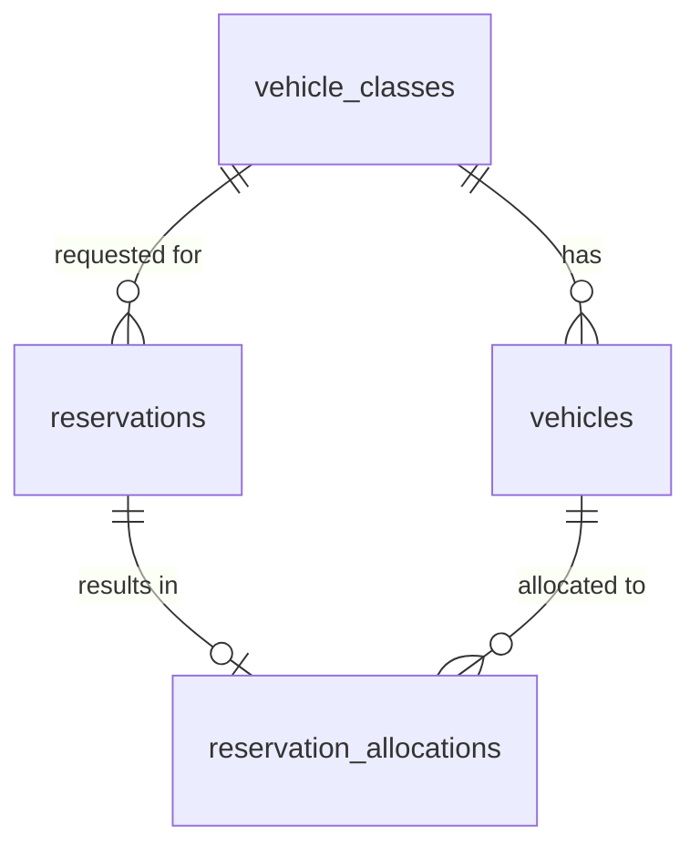

# Database Design - Reservation Allocation

## Table of Contents
- [vehicle_classes](#vehicle_classes)
- [vehicles](#vehicles)
- [reservations](#reservations)
- [reservation_allocations](#reservation_allocations)

## Entity Relationship Diagram

## Tables

### vehicle_classes

| Field | Data Type | Index | Constraint | Description |
| --- | --- | --- | --- | --- |
| id | uuid | Primary Key | NOT NULL | Unique identifier of the vehicle class |
| name | text |  | NOT NULL, UNIQUE | Name of the vehicle class (e.g., Economy, SUV) |
| created_at | timestamp with timezone |  | NOT NULL | Record creation timestamp |
| updated_at | timestamp with timezone |  | NOT NULL | Record last update timestamp |
| deleted_at | timestamp with timezone |  |  | Record deletion timestamp |
| created_by | text |  | NOT NULL | User who created the record |
| updated_by | text |  | NOT NULL | User who last updated the record |
| deleted | bool |  | NOT NULL, DEFAULT false | Soft-delete flag |

### vehicles

| Field | Data Type | Index | Constraint | Description |
| --- | --- | --- | --- | --- |
| id | uuid | Primary Key | NOT NULL | Unique identifier of the vehicle |
| vehicle_class_id | uuid | Index (FK) | NOT NULL, FOREIGN KEY references vehicle_classes(id) | Class the vehicle belongs to |
| status | text | Index | NOT NULL | Current vehicle status (e.g., available, reserved, in-maintenance, decommissioned) |
| created_at | timestamp with timezone |  | NOT NULL | Record creation timestamp |
| updated_at | timestamp with timezone |  | NOT NULL | Record last update timestamp |
| deleted_at | timestamp with timezone |  |  | Record deletion timestamp |
| created_by | text |  | NOT NULL | User who created the record |
| updated_by | text |  | NOT NULL | User who last updated the record |
| deleted | bool |  | NOT NULL, DEFAULT false | Soft-delete flag |

### reservations

| Field | Data Type | Index | Constraint | Description |
| --- | --- | --- | --- | --- |
| id | uuid | Primary Key | NOT NULL | Unique identifier of the reservation |
| vehicle_class_id | uuid | Index (FK) | NOT NULL, FOREIGN KEY references vehicle_classes(id) | Requested vehicle class |
| start_at | timestamp with timezone | Index | NOT NULL | Requested rental start date/time |
| end_at | timestamp with timezone | Index | NOT NULL | Requested rental end date/time |
| status | text | Index | NOT NULL | Reservation status (e.g., requested, confirmed, unfulfillable, cancelled) |
| requested_at | timestamp with timezone |  | NOT NULL | Timestamp when the reservation request was received, used for first-come-first-served ordering |
| created_at | timestamp with timezone |  | NOT NULL | Record creation timestamp |
| updated_at | timestamp with timezone |  | NOT NULL | Record last update timestamp |
| deleted_at | timestamp with timezone |  |  | Record deletion timestamp |
| created_by | text |  | NOT NULL | User who created the record |
| updated_by | text |  | NOT NULL | User who last updated the record |
| deleted | bool |  | NOT NULL, DEFAULT false | Soft-delete flag |

### reservation_allocations

| Field | Data Type | Index | Constraint | Description |
| --- | --- | --- | --- | --- |
| id | uuid | Primary Key | NOT NULL | Unique identifier of the allocation record |
| reservation_id | uuid | Index (FK), UNIQUE | NOT NULL, FOREIGN KEY references reservations(id) | Reservation that this allocation fulfills |
| vehicle_id | uuid | Index (FK) | NOT NULL, FOREIGN KEY references vehicles(id) | Vehicle allocated to the reservation |
| allocated_at | timestamp with timezone |  | NOT NULL | Timestamp when the allocation decision was made |
| created_at | timestamp with timezone |  | NOT NULL | Record creation timestamp |
| updated_at | timestamp with timezone |  | NOT NULL | Record last update timestamp |
| deleted_at | timestamp with timezone |  |  | Record deletion timestamp |
| created_by | text |  | NOT NULL | User who created the record |
| updated_by | text |  | NOT NULL | User who last updated the record |
| deleted | bool |  | NOT NULL, DEFAULT false | Soft-delete flag |
