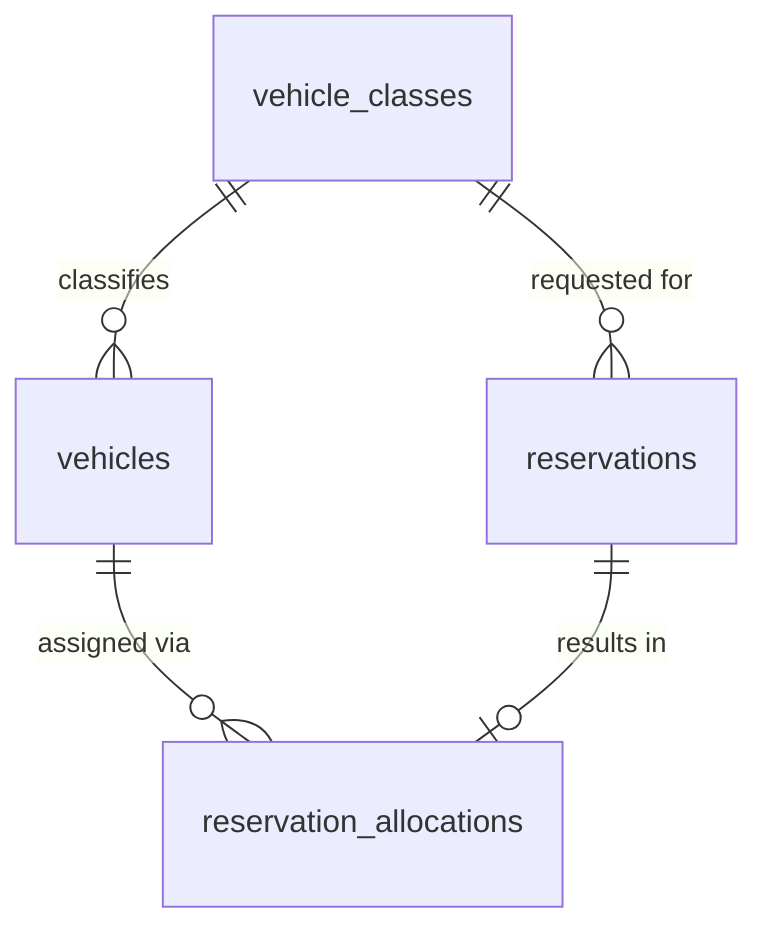

# Database Design - Reservation Allocation

## Table of Contents
- [vehicle_classes](#vehicle_classes)
- [reservations](#reservations)
- [reservation_allocations](#reservation_allocations)

## Entity Relationship Diagram

> **Note:** `vehicles` is defined by the [Database Design - Vehicle Onboarding](./database-design-vehicle-onboarding.md) document, which contains the canonical, consolidated table definition (merged across the Vehicle Onboarding, Location & Inventory Management, Reservation Allocation, and Maintenance & Service Scheduling TRDs). It is shown here only as a reference for relationships; its full table design is out of scope for this document. 

## Table Designs

### vehicle_classes

| Field | Data Type | Index | Constraint | Description |
| --- | --- | --- | --- | --- |
| id | UUID | Primary Key | NOT NULL | Unique identifier of the vehicle class |
| name | TEXT | Unique Index | NOT NULL, UNIQUE | Name of the vehicle class (e.g., Economy, SUV) |
| description | TEXT | - | - | Description of the vehicle class |
| created_at | TIMESTAMP WITH TIME ZONE | - | NOT NULL | Record creation timestamp |
| updated_at | TIMESTAMP WITH TIME ZONE | - | NOT NULL | Record last update timestamp |
| deleted_at | TIMESTAMP WITH TIME ZONE | - | - | Record soft-delete timestamp |
| created_by | TEXT | - | NOT NULL | User/system that created the record |
| updated_by | TEXT | - | NOT NULL | User/system that last updated the record |
| deleted | BOOL | - | NOT NULL, DEFAULT false | Soft-delete flag |

### reservations

| Field | Data Type | Index | Constraint | Description |
| --- | --- | --- | --- | --- |
| id | UUID | Primary Key | NOT NULL | Unique identifier of the reservation |
| vehicle_class_id | UUID | Index | NOT NULL, FOREIGN KEY (vehicle_classes.id) | Requested vehicle class |
| pickup_location_id | UUID | Index | NOT NULL | Requested pickup location (reference to Location & Inventory Management TRD) |
| pickup_datetime | TIMESTAMP WITH TIME ZONE | Index | NOT NULL | Requested pickup date/time |
| return_datetime | TIMESTAMP WITH TIME ZONE | Index | NOT NULL, CHECK (return_datetime > pickup_datetime) | Requested return date/time |
| allocation_status | TEXT | Index | NOT NULL, DEFAULT 'pending' | Allocation outcome: `pending`, `allocated`, `unfulfillable` |
| created_at | TIMESTAMP WITH TIME ZONE | - | NOT NULL | Record creation timestamp |
| updated_at | TIMESTAMP WITH TIME ZONE | - | NOT NULL | Record last update timestamp |
| deleted_at | TIMESTAMP WITH TIME ZONE | - | - | Record soft-delete timestamp |
| created_by | TEXT | - | NOT NULL | User/system that created the record |
| updated_by | TEXT | - | NOT NULL | User/system that last updated the record |
| deleted | BOOL | - | NOT NULL, DEFAULT false | Soft-delete flag |

### reservation_allocations

| Field | Data Type | Index | Constraint | Description |
| --- | --- | --- | --- | --- |
| id | UUID | Primary Key | NOT NULL | Unique identifier of the allocation record |
| reservation_id | UUID | Unique Index | NOT NULL, UNIQUE, FOREIGN KEY (reservations.id) | Reservation this allocation belongs to |
| vehicle_id | UUID | Index | NOT NULL, FOREIGN KEY (vehicles.id) | Vehicle allocated to the reservation |
| allocated_at | TIMESTAMP WITH TIME ZONE | - | NOT NULL | Timestamp when the allocation decision was made |
| created_at | TIMESTAMP WITH TIME ZONE | - | NOT NULL | Record creation timestamp |
| updated_at | TIMESTAMP WITH TIME ZONE | - | NOT NULL | Record last update timestamp |
| deleted_at | TIMESTAMP WITH TIME ZONE | - | - | Record soft-delete timestamp |
| created_by | TEXT | - | NOT NULL | User/system that created the record |
| updated_by | TEXT | - | NOT NULL | User/system that last updated the record |
| deleted | BOOL | - | NOT NULL, DEFAULT false | Soft-delete flag |

> **Note:** The `UNIQUE` constraint on `reservation_id` ensures a reservation has, at most, one active allocation, consistent with the no-overbooking requirement.

## AI usage disclaimer
*This document was generated with the assistance of artificial intelligence and should be reviewed by a human for accuracy and completeness.*
