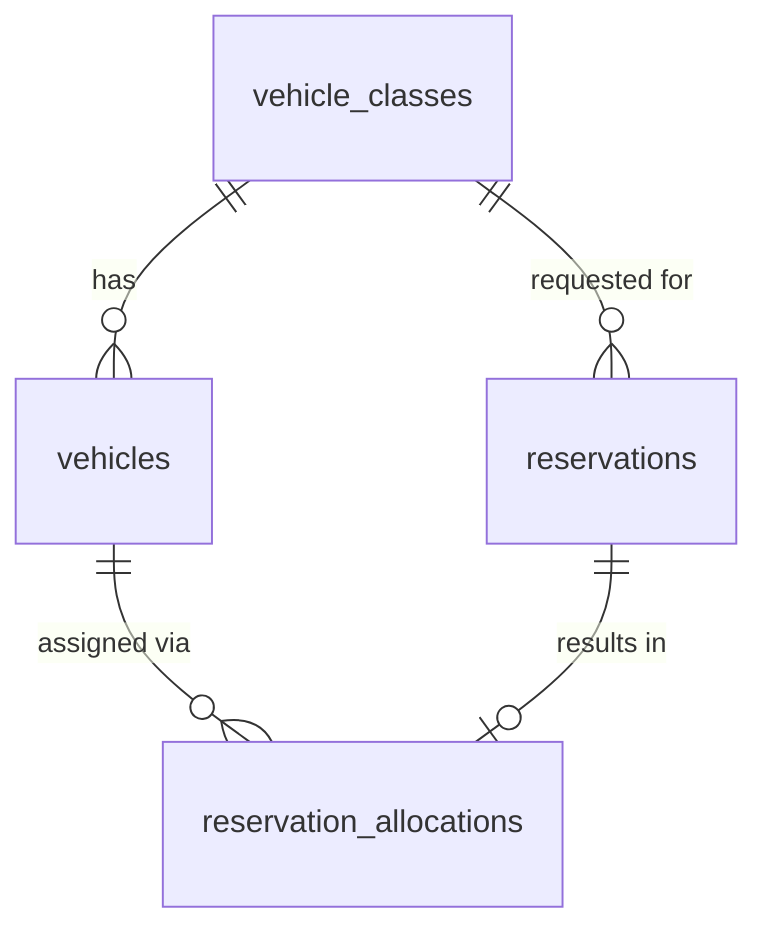

# Database Design - Reservation Allocation

## Table of Contents
- [vehicle_classes](#vehicle_classes)
- [vehicles](#vehicles)
- [reservations](#reservations)
- [reservation_allocations](#reservation_allocations)

## Entity Relationship Diagram

## Table Designs

### vehicle_classes

| Field | Data Type | Index | Constraint | Description |
| --- | --- | --- | --- | --- |
| id | UUID | Primary Key | NOT NULL | Unique identifier of the vehicle class |
| name | TEXT | Unique Index | NOT NULL, UNIQUE | Name of the vehicle class (e.g., Economy, SUV) |
| description | TEXT | - | - | Description of the vehicle class |
| created_at | TIMESTAMP WITH TIME ZONE | - | NOT NULL | Record creation timestamp |
| updated_at | TIMESTAMP WITH TIME ZONE | - | NOT NULL | Record last update timestamp |
| deleted_at | TIMESTAMP WITH TIME ZONE | - | - | Record soft-delete timestamp |
| created_by | TEXT | - | NOT NULL | User/system that created the record |
| updated_by | TEXT | - | NOT NULL | User/system that last updated the record |
| deleted | BOOL | - | NOT NULL, DEFAULT false | Soft-delete flag |

### vehicles

> **Note:** This is the canonical `vehicles` table shared with the Vehicle Onboarding and Location & Inventory Management TRDs. It merges the fields introduced across those TRDs with the fields required for Reservation Allocation, so that a single, non-redundant definition exists across all TRDs. Only the fields, index, and constraint details relevant to those TRDs are repeated here for completeness; refer to the Vehicle Onboarding TRD for the full field-level validation rules.

| Field | Data Type | Index | Constraint | Description |
| --- | --- | --- | --- | --- |
| id | UUID | Primary Key | NOT NULL | Unique identifier of the vehicle |
| vin | TEXT | Unique Index | NOT NULL, UNIQUE | Vehicle identification number |
| license_plate | TEXT | Unique Index | NOT NULL, UNIQUE | Vehicle license plate/registration number |
| purchase_date | DATE | - | NOT NULL | Date the vehicle was purchased |
| purchase_cost | DECIMAL(15,2) | - | NOT NULL | Purchase cost of the vehicle |
| insurance_policy_number | TEXT | - | NOT NULL | Insurance policy number |
| insurance_expiry_date | DATE | - | NOT NULL | Insurance policy expiry date |
| odometer_reading | INTEGER | - | NOT NULL, CHECK (odometer_reading >= 0) | Latest odometer reading, in kilometers |
| brand | TEXT | - | NOT NULL | Vehicle manufacturer brand |
| model | TEXT | - | NOT NULL | Vehicle model |
| manufacturing_year | INTEGER | - | NOT NULL | Year the vehicle was manufactured |
| size | TEXT | Index | NOT NULL, CHECK (size IN ('small', 'medium')) | Vehicle size classification |
| vehicle_class_id | UUID | Index | NOT NULL, FOREIGN KEY (vehicle_classes.id) | Vehicle class the vehicle belongs to, used to match reservations of the same class |
| seats | INTEGER | - | NOT NULL, CHECK (seats > 0) | Number of seats |
| fuel_type | TEXT | Index | NOT NULL, CHECK (fuel_type IN ('gas', 'electric', 'hybrid')) | Vehicle fuel type |
| ownership | TEXT | - | NOT NULL, DEFAULT 'company' | Owner of the vehicle; always the company |
| status | TEXT | Index | NOT NULL, CHECK (status IN ('Incoming', 'Active', 'Maintenance', 'Decommissioning', 'Sold')), DEFAULT 'Incoming' | Current lifecycle status of the vehicle |
| home_location_id | UUID | Index | NOT NULL, FOREIGN KEY (locations.id) | Home location the vehicle is assigned to (see Location & Inventory Management TRD) |
| created_at | TIMESTAMP WITH TIME ZONE | - | NOT NULL | Record creation timestamp |
| updated_at | TIMESTAMP WITH TIME ZONE | - | NOT NULL | Record last update timestamp |
| deleted_at | TIMESTAMP WITH TIME ZONE | - | - | Record soft-delete timestamp |
| created_by | TEXT | - | NOT NULL | User/system that created the record |
| updated_by | TEXT | - | NOT NULL | User/system that last updated the record |
| deleted | BOOL | - | NOT NULL, DEFAULT false | Soft-delete flag |

> **Note on merged fields/constraints:**
> - `vehicle_class_id` (a foreign key to `vehicle_classes`) supersedes any flat `class` enum field, so vehicle classification is extensible and can be matched directly against a reservation's requested `vehicle_class_id`.
> - `license_plate` supersedes any separately named `registration_number` field; both referred to the same data.
> - `status` is the single lifecycle status column shared by all TRDs referencing this table (`Incoming`, `Active`, `Maintenance`, `Decommissioning`, `Sold`). Reservation Allocation only considers vehicles with `status = 'Active'` as allocation candidates; time-based conflicts among `Active` vehicles are resolved by checking for overlapping records in `reservation_allocations`, not by a separate allocation-specific status value.

### reservations

| Field | Data Type | Index | Constraint | Description |
| --- | --- | --- | --- | --- |
| id | UUID | Primary Key | NOT NULL | Unique identifier of the reservation |
| vehicle_class_id | UUID | Index | NOT NULL, FOREIGN KEY (vehicle_classes.id) | Requested vehicle class |
| pickup_location_id | UUID | Index | NOT NULL | Requested pickup location (reference to Location & Inventory Management TRD) |
| pickup_datetime | TIMESTAMP WITH TIME ZONE | Index | NOT NULL | Requested pickup date/time |
| return_datetime | TIMESTAMP WITH TIME ZONE | Index | NOT NULL, CHECK (return_datetime > pickup_datetime) | Requested return date/time |
| allocation_status | TEXT | Index | NOT NULL, DEFAULT 'pending' | Allocation outcome: `pending`, `allocated`, `unfulfillable` |
| created_at | TIMESTAMP WITH TIME ZONE | - | NOT NULL | Record creation timestamp |
| updated_at | TIMESTAMP WITH TIME ZONE | - | NOT NULL | Record last update timestamp |
| deleted_at | TIMESTAMP WITH TIME ZONE | - | - | Record soft-delete timestamp |
| created_by | TEXT | - | NOT NULL | User/system that created the record |
| updated_by | TEXT | - | NOT NULL | User/system that last updated the record |
| deleted | BOOL | - | NOT NULL, DEFAULT false | Soft-delete flag |

### reservation_allocations

| Field | Data Type | Index | Constraint | Description |
| --- | --- | --- | --- | --- |
| id | UUID | Primary Key | NOT NULL | Unique identifier of the allocation record |
| reservation_id | UUID | Unique Index | NOT NULL, UNIQUE, FOREIGN KEY (reservations.id) | Reservation this allocation belongs to |
| vehicle_id | UUID | Index | NOT NULL, FOREIGN KEY (vehicles.id) | Vehicle allocated to the reservation |
| allocated_at | TIMESTAMP WITH TIME ZONE | - | NOT NULL | Timestamp when the allocation decision was made |
| created_at | TIMESTAMP WITH TIME ZONE | - | NOT NULL | Record creation timestamp |
| updated_at | TIMESTAMP WITH TIME ZONE | - | NOT NULL | Record last update timestamp |
| deleted_at | TIMESTAMP WITH TIME ZONE | - | - | Record soft-delete timestamp |
| created_by | TEXT | - | NOT NULL | User/system that created the record |
| updated_by | TEXT | - | NOT NULL | User/system that last updated the record |
| deleted | BOOL | - | NOT NULL, DEFAULT false | Soft-delete flag |

> **Note:** The `UNIQUE` constraint on `reservation_id` ensures a reservation has, at most, one active allocation, consistent with the no-overbooking requirement.
