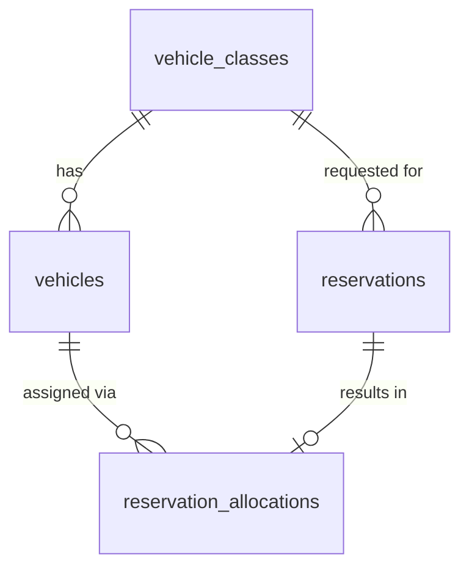

# Database Design - Reservation Allocation

## Table of Contents
- [vehicle_classes](#vehicle_classes)
- [vehicles](#vehicles)
- [reservations](#reservations)
- [reservation_allocations](#reservation_allocations)

## Entity Relationship Diagram

## Table Designs

### vehicle_classes

| Field | Data Type | Index | Constraint | Description |
| --- | --- | --- | --- | --- |
| id | UUID | Primary Key | NOT NULL | Unique identifier of the vehicle class |
| name | TEXT | Unique Index | NOT NULL, UNIQUE | Name of the vehicle class (e.g., Economy, SUV) |
| description | TEXT | - | - | Description of the vehicle class |
| created_at | TIMESTAMP WITH TIME ZONE | - | NOT NULL | Record creation timestamp |
| updated_at | TIMESTAMP WITH TIME ZONE | - | NOT NULL | Record last update timestamp |
| deleted_at | TIMESTAMP WITH TIME ZONE | - | - | Record soft-delete timestamp |
| created_by | TEXT | - | NOT NULL | User/system that created the record |
| updated_by | TEXT | - | NOT NULL | User/system that last updated the record |
| deleted | BOOL | - | NOT NULL, DEFAULT false | Soft-delete flag |

### vehicles

| Field | Data Type | Index | Constraint | Description |
| --- | --- | --- | --- | --- |
| id | UUID | Primary Key | NOT NULL | Unique identifier of the vehicle |
| vehicle_class_id | UUID | Index | NOT NULL, FOREIGN KEY (vehicle_classes.id) | Class the vehicle belongs to |
| registration_number | TEXT | Unique Index | NOT NULL, UNIQUE | Vehicle registration/plate number |
| status | TEXT | Index | NOT NULL | Current availability status (e.g., available, allocated, maintenance) |
| created_at | TIMESTAMP WITH TIME ZONE | - | NOT NULL | Record creation timestamp |
| updated_at | TIMESTAMP WITH TIME ZONE | - | NOT NULL | Record last update timestamp |
| deleted_at | TIMESTAMP WITH TIME ZONE | - | - | Record soft-delete timestamp |
| created_by | TEXT | - | NOT NULL | User/system that created the record |
| updated_by | TEXT | - | NOT NULL | User/system that last updated the record |
| deleted | BOOL | - | NOT NULL, DEFAULT false | Soft-delete flag |

> **Note:** `status` values relevant to allocation are limited to values indicating whether the vehicle is available for allocation (e.g., `available`) or not (e.g., `allocated`, `maintenance`, `out_of_service`). Full lifecycle status management is defined in the Vehicle Status & Telemetry TRD.

### reservations

| Field | Data Type | Index | Constraint | Description |
| --- | --- | --- | --- | --- |
| id | UUID | Primary Key | NOT NULL | Unique identifier of the reservation |
| vehicle_class_id | UUID | Index | NOT NULL, FOREIGN KEY (vehicle_classes.id) | Requested vehicle class |
| pickup_location_id | UUID | Index | NOT NULL | Requested pickup location (reference to Location & Inventory Management TRD) |
| pickup_datetime | TIMESTAMP WITH TIME ZONE | Index | NOT NULL | Requested pickup date/time |
| return_datetime | TIMESTAMP WITH TIME ZONE | Index | NOT NULL, CHECK (return_datetime > pickup_datetime) | Requested return date/time |
| allocation_status | TEXT | Index | NOT NULL, DEFAULT 'pending' | Allocation outcome: `pending`, `allocated`, `unfulfillable` |
| created_at | TIMESTAMP WITH TIME ZONE | - | NOT NULL | Record creation timestamp |
| updated_at | TIMESTAMP WITH TIME ZONE | - | NOT NULL | Record last update timestamp |
| deleted_at | TIMESTAMP WITH TIME ZONE | - | - | Record soft-delete timestamp |
| created_by | TEXT | - | NOT NULL | User/system that created the record |
| updated_by | TEXT | - | NOT NULL | User/system that last updated the record |
| deleted | BOOL | - | NOT NULL, DEFAULT false | Soft-delete flag |

### reservation_allocations

| Field | Data Type | Index | Constraint | Description |
| --- | --- | --- | --- | --- |
| id | UUID | Primary Key | NOT NULL | Unique identifier of the allocation record |
| reservation_id | UUID | Unique Index | NOT NULL, UNIQUE, FOREIGN KEY (reservations.id) | Reservation this allocation belongs to |
| vehicle_id | UUID | Index | NOT NULL, FOREIGN KEY (vehicles.id) | Vehicle allocated to the reservation |
| allocated_at | TIMESTAMP WITH TIME ZONE | - | NOT NULL | Timestamp when the allocation decision was made |
| created_at | TIMESTAMP WITH TIME ZONE | - | NOT NULL | Record creation timestamp |
| updated_at | TIMESTAMP WITH TIME ZONE | - | NOT NULL | Record last update timestamp |
| deleted_at | TIMESTAMP WITH TIME ZONE | - | - | Record soft-delete timestamp |
| created_by | TEXT | - | NOT NULL | User/system that created the record |
| updated_by | TEXT | - | NOT NULL | User/system that last updated the record |
| deleted | BOOL | - | NOT NULL, DEFAULT false | Soft-delete flag |

> **Note:** The `UNIQUE` constraint on `reservation_id` ensures a reservation has, at most, one active allocation, consistent with the no-overbooking requirement.
