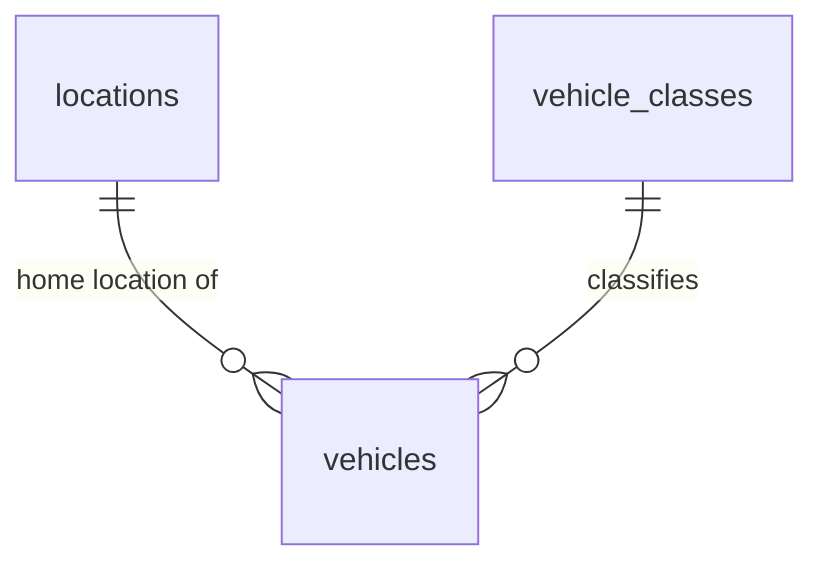

# Database Design - Vehicle Onboarding

## Table of Contents
- [vehicles](#vehicles)
- [locations](#locations)

## Entity Relationship Diagram

## Tables

### vehicles
> Note: This is the canonical definition of the `vehicles` table, merged from the Vehicle Onboarding, Location & Inventory Management, Reservation Allocation, and Maintenance & Service Scheduling TRDs. Other TRDs must reference this table instead of redefining it. `registration_number` (used in an earlier Reservation Allocation draft) and `license_plate` referred to the same data and have been consolidated into `license_plate`. The `class` enum previously defined directly on this table has been replaced by `vehicle_class_id`, a foreign key to the `vehicle_classes` table (see [Database Design - Reservation Allocation](./database-design-reservation-allocation.md)), so vehicle classification is maintained in one place. `current_odometer` was added by the Maintenance & Service Scheduling TRD to track the vehicle's latest known mileage, distinct from `odometer_reading` (the reading captured at onboarding), so that mileage-based maintenance thresholds can be evaluated.

| Field | Data Type | Index | Constraint | Description |
| --- | --- | --- | --- | --- |
| id | UUID | Primary Key | NOT NULL, DEFAULT gen_random_uuid() | Unique identifier of the vehicle. |
| vin | TEXT | Unique Index | NOT NULL, UNIQUE | Vehicle identification number. |
| license_plate | TEXT | Unique Index | NOT NULL, UNIQUE | Vehicle license plate (registration number). |
| purchase_date | DATE | | NOT NULL | Date the vehicle was purchased. |
| purchase_cost | DECIMAL(15,2) | | NOT NULL | Purchase cost of the vehicle. |
| insurance_policy_number | TEXT | | NOT NULL | Insurance policy number. |
| insurance_expiry_date | DATE | | NOT NULL | Insurance policy expiry date. |
| odometer_reading | INTEGER | | NOT NULL, CHECK (odometer_reading >= 0) | Odometer reading at onboarding, in the standard unit (km). |
| current_odometer | INTEGER | Index | NOT NULL, CHECK (current_odometer >= odometer_reading), DEFAULT 0 | Latest known odometer reading (km), used to evaluate mileage-based maintenance thresholds. Updated whenever a newer reading is captured (e.g., at maintenance scheduling); the mechanism that keeps this in sync with in-service driving activity is out of scope for this table's owning TRDs. |
| brand | TEXT | | NOT NULL | Vehicle manufacturer brand. |
| model | TEXT | | NOT NULL | Vehicle model. |
| manufacturing_year | INTEGER | | NOT NULL | Year the vehicle was manufactured. |
| size | TEXT | Index | NOT NULL, CHECK (size IN ('small', 'medium')) | Vehicle size classification. |
| vehicle_class_id | UUID | Index, Foreign Key | NOT NULL, REFERENCES vehicle_classes(id) | Vehicle class the vehicle belongs to (e.g., economy, luxury). |
| seats | INTEGER | | NOT NULL, CHECK (seats > 0) | Number of seats. |
| fuel_type | TEXT | Index | NOT NULL, CHECK (fuel_type IN ('gas', 'electric', 'hybrid')) | Vehicle fuel type. |
| ownership | TEXT | | NOT NULL, DEFAULT 'company' | Owner of the vehicle; always the company. |
| status | TEXT | Index | NOT NULL, CHECK (status IN ('Incoming', 'Active', 'Maintenance', 'Decommissioning', 'Sold')), DEFAULT 'Incoming' | Current lifecycle status of the vehicle. This is the single status field for the vehicle: it supersedes the separate `available`/`allocated`/`out_of_service` status previously proposed for Reservation Allocation. Only `Active` vehicles are eligible for reservation allocation; whether an `Active` vehicle is currently allocated to a reservation is derived from `reservation_allocations`/`vehicle_availability_blocks`, not stored as a distinct status value here. |
| home_location_id | UUID | Foreign Key | NOT NULL, REFERENCES locations(id) | Home location the vehicle is assigned to. |
| created_at | TIMESTAMP WITH TIME ZONE | | NOT NULL | Record creation timestamp. |
| updated_at | TIMESTAMP WITH TIME ZONE | | NOT NULL | Record last update timestamp. |
| deleted_at | TIMESTAMP WITH TIME ZONE | | | Record soft-deletion timestamp. |
| created_by | TEXT | | NOT NULL | User who created the record. |
| updated_by | TEXT | | NOT NULL | User who last updated the record. |
| deleted | BOOLEAN | | NOT NULL, DEFAULT false | Soft-delete flag. |

### locations
> Note: This table is a minimal reference used to assign a vehicle's home location. Full location and inventory management is out of scope for the Vehicle Onboarding TRD; see [Location & Inventory Management](../prd/prd-car-management.md#2-location--inventory-management).

| Field | Data Type | Index | Constraint | Description |
| --- | --- | --- | --- | --- |
| id | UUID | Primary Key | NOT NULL, DEFAULT gen_random_uuid() | Unique identifier of the location. |
| name | TEXT | Unique Index | NOT NULL, UNIQUE | Name of the location. |
| created_at | TIMESTAMP WITH TIME ZONE | | NOT NULL | Record creation timestamp. |
| updated_at | TIMESTAMP WITH TIME ZONE | | NOT NULL | Record last update timestamp. |
| deleted_at | TIMESTAMP WITH TIME ZONE | | | Record soft-deletion timestamp. |
| created_by | TEXT | | NOT NULL | User who created the record. |
| updated_by | TEXT | | NOT NULL | User who last updated the record. |
| deleted | BOOLEAN | | NOT NULL, DEFAULT false | Soft-delete flag. |
