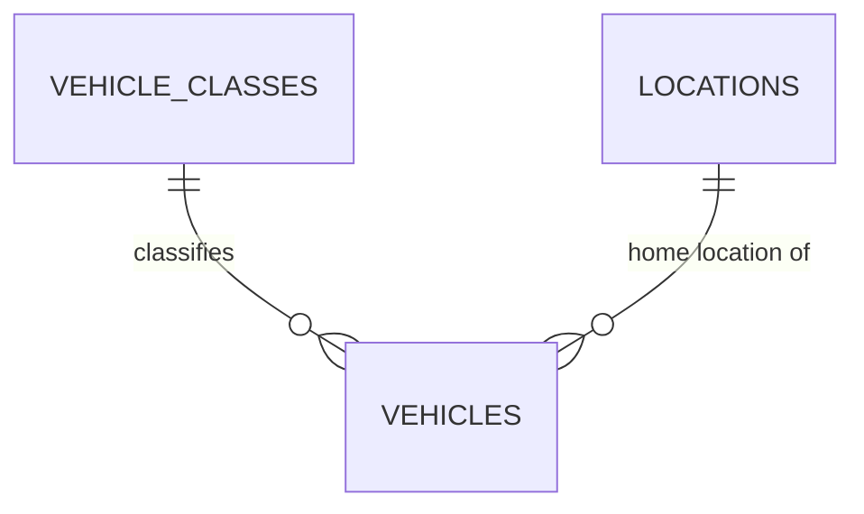

# Database Design - Vehicle (Shared Core Entity)

> This file consolidates the `vehicles` table definition previously duplicated across the Vehicle Onboarding, Reservation Allocation, and Location & Inventory Management TRDs into a single, canonical source of truth. Any TRD that needs to reference the vehicle entity should link to this file instead of redefining the table.

## Table of Contents
- [vehicle_classes](#vehicle_classes)
- [vehicles](#vehicles)

## Entity Relationship Diagram

> Note: `LOCATIONS` is defined in [Database Design - Car Management: Location & Inventory Management](./database-design-car-management-location-inventory.md) and is shown here only as a reference for the relationship.

## Tables

### vehicle_classes

| Field | Data Type | Index | Constraint | Description |
| --- | --- | --- | --- | --- |
| id | UUID | Primary Key | NOT NULL, DEFAULT gen_random_uuid() | Unique identifier of the vehicle class |
| name | TEXT | Unique Index | NOT NULL, UNIQUE, CHECK (name IN ('economy', 'luxury')) | Name of the vehicle class, per the class classification defined in Vehicle Onboarding. Adding a new class in the future requires updating this CHECK constraint. |
| description | TEXT | - | NULL | Description of the vehicle class |
| created_at | TIMESTAMP WITH TIME ZONE | - | NOT NULL, DEFAULT now() | Record creation timestamp |
| updated_at | TIMESTAMP WITH TIME ZONE | - | NOT NULL, DEFAULT now() | Record last update timestamp |
| deleted_at | TIMESTAMP WITH TIME ZONE | - | NULL | Record deletion timestamp |
| created_by | TEXT | - | NOT NULL | Identifier of the user/system that created the record |
| updated_by | TEXT | - | NOT NULL | Identifier of the user/system that last updated the record |
| deleted | BOOLEAN | - | NOT NULL, DEFAULT false | Soft-delete flag |

### vehicles

| Field | Data Type | Index | Constraint | Description |
| --- | --- | --- | --- | --- |
| id | UUID | Primary Key | NOT NULL, DEFAULT gen_random_uuid() | Unique identifier of the vehicle |
| vin | TEXT | Unique Index | NOT NULL, UNIQUE | Vehicle identification number |
| license_plate | TEXT | Unique Index | NOT NULL, UNIQUE | Vehicle license plate (the single canonical field for plate/registration number) |
| purchase_date | DATE | - | NOT NULL | Date the vehicle was purchased |
| purchase_cost | DECIMAL(15,2) | - | NOT NULL | Purchase cost of the vehicle |
| insurance_policy_number | TEXT | - | NOT NULL | Insurance policy number |
| insurance_expiry_date | DATE | - | NOT NULL | Insurance policy expiry date |
| odometer_reading | INTEGER | - | NOT NULL, CHECK (odometer_reading >= 0) | Odometer reading, in the standard unit (km) |
| brand | TEXT | - | NOT NULL | Vehicle manufacturer brand |
| model | TEXT | - | NOT NULL | Vehicle model |
| manufacturing_year | INTEGER | - | NOT NULL | Year the vehicle was manufactured |
| size | TEXT | Index | NOT NULL, CHECK (size IN ('small', 'medium')) | Vehicle size classification |
| vehicle_class_id | UUID | Index | NOT NULL, FOREIGN KEY (vehicle_classes.id) | Class the vehicle belongs to (replaces a free-text `class` field) |
| seats | INTEGER | - | NOT NULL, CHECK (seats > 0) | Number of seats |
| fuel_type | TEXT | Index | NOT NULL, CHECK (fuel_type IN ('gas', 'electric', 'hybrid')) | Vehicle fuel type |
| ownership | TEXT | - | NOT NULL, DEFAULT 'company' | Owner of the vehicle; always the company |
| status | TEXT | Index | NOT NULL, CHECK (status IN ('Incoming', 'Active', 'Maintenance', 'Decommissioning', 'Sold')), DEFAULT 'Incoming' | Current lifecycle status of the vehicle. This is the single status field for the vehicle; there is no separate allocation/availability status. A vehicle is a candidate for reservation allocation only when `status = 'Active'` and it has no overlapping entry in `vehicle_availability_blocks` (see [Location & Inventory Management](./database-design-car-management-location-inventory.md#vehicle_availability_blocks)). |
| home_location_id | UUID | Index, Foreign Key | NOT NULL, REFERENCES locations(id) | Home location the vehicle is assigned to |
| created_at | TIMESTAMP WITH TIME ZONE | - | NOT NULL, DEFAULT now() | Record creation timestamp |
| updated_at | TIMESTAMP WITH TIME ZONE | - | NOT NULL, DEFAULT now() | Record last update timestamp |
| deleted_at | TIMESTAMP WITH TIME ZONE | - | NULL | Record deletion timestamp |
| created_by | TEXT | - | NOT NULL | Identifier of the user/system that created the record |
| updated_by | TEXT | - | NOT NULL | Identifier of the user/system that last updated the record |
| deleted | BOOLEAN | - | NOT NULL, DEFAULT false | Soft-delete flag |

#### Merge Notes
This table merges the previously divergent `vehicles` definitions from the Vehicle Onboarding and Reservation Allocation TRDs:
- **Removed redundant fields:** `registration_number` (Reservation Allocation) was a duplicate of `license_plate` (Vehicle Onboarding); only `license_plate` is kept. The free-text `class` field (Vehicle Onboarding) was a duplicate concept of `vehicle_class_id` (Reservation Allocation); only the normalized `vehicle_class_id` foreign key is kept, with the vehicle class values (`economy`, `luxury`) enforced in `vehicle_classes.name`.
- **Merged `status` constraint:** Vehicle Onboarding defined `status` as the full vehicle lifecycle (`Incoming`, `Active`, `Maintenance`, `Decommissioning`, `Sold`). Reservation Allocation defined a separate, narrower `status` (`available`, `allocated`, `maintenance`, `out_of_service`) for allocation purposes. These represented the same underlying concept (whether a vehicle is fit to be rented) with inconsistent values. The merged design keeps a single lifecycle `status` field with the Vehicle Onboarding CHECK constraint values; allocation eligibility is derived from `status = 'Active'` combined with the absence of an overlapping `vehicle_availability_blocks` entry, rather than tracked as a separate status.
