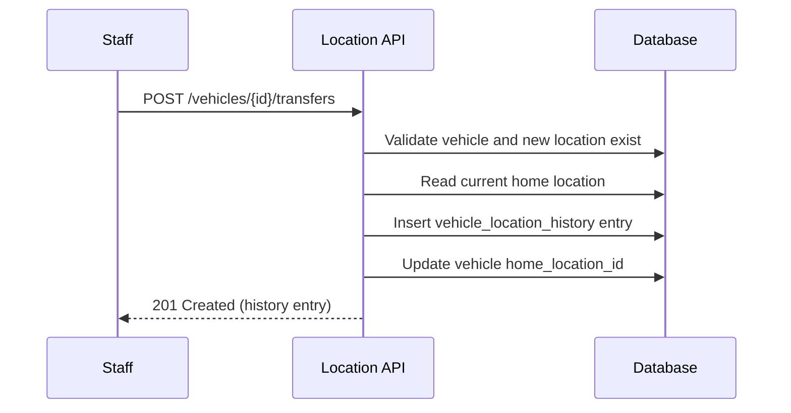
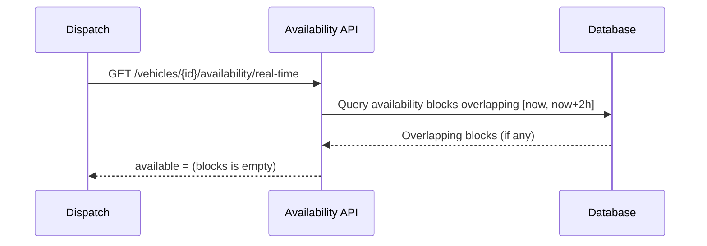

# TRD - Car Management: Location & Inventory Management

## Document Information
- Feature Name: Car Management - Location & Inventory Management
- Author: copilot
- Date:
- Version:

## Table of Contents
- [Background](#background)
- [In Scope](#in-scope)
- [Constraints](#constraints)
- [Technical Requirements](#technical-requirements)
  - [Database Design](#database-design)
  - [Frontend](#frontend)
  - [Backend](#backend)
- [Security Requirement](#security-requirement)
- [Non-Functional Requirements](#non-functional-requirements)
- [AI usage disclaimer](#ai-usage-disclaimer)

## Background
This TRD implements the [Location & Inventory Management](https://github.com/timpamungkas/ai-sdlc/blob/main/docs/prd/prd-car-management.md#2-location--inventory-management) functional requirement from the PRD - Car Management. It covers tracking a vehicle's home location and transfer history, and exposing real-time and planned vehicle availability so dispatch staff can allocate vehicles without conflicts.

## In Scope
- Recording a vehicle's current home location.
- Transferring a vehicle to a new home location, including creation of a historical record (previous location, new location, transfer date).
- Attributing transfer costs to the company pool (not to a customer or location).
- Retrieving a vehicle's home-location transfer history.
- Computing real-time availability, defined as the vehicle's status for the next 2 hours from the current time.
- Computing planned availability, defined as a rolling window from the next day (H+1) through 30 days ahead (H+30), accounting for existing reservations, maintenance blocks, and transfers.
- Read-only integration points that consume reservation, maintenance, and transfer records to determine availability blocks (the block records themselves; not the business logic that creates reservations or maintenance schedules).

## Constraints
- The logic for creating, confirming, or cancelling reservations is out of scope; this document only consumes reservation-driven availability blocks (see Reservation Allocation TRD).
- The logic for scheduling maintenance or determining maintenance thresholds is out of scope; this document only consumes maintenance-driven availability blocks (see Maintenance & Service Scheduling TRD).
- Vehicle onboarding fields and lifecycle status transitions (Incoming, Active, Maintenance, Decommissioning, Sold) are out of scope (see Vehicle Onboarding TRD); this document only reads the vehicle's current lifecycle status where relevant to availability.
- GPS telemetry and geofencing are out of scope (see Vehicle Status & Telemetry TRD).
- Approval workflows for transfers (e.g., manager sign-off) are not covered; transfers are recorded as submitted.
- UI/UX mockups and visual design are not covered; only functional and validation requirements are described.

## Technical Requirements

### Database Design
The following tables are required for this feature. Table definitions are documented in [database-design-car-management-location-inventory.md](./database-design-car-management-location-inventory.md):
- `locations`
- `vehicle_location_history`
- `vehicle_availability_blocks`

This feature references the `vehicles` table, whose canonical, merged definition (consolidated across the Vehicle Onboarding, Reservation Allocation, and Location & Inventory Management TRDs) is documented in [database-design-vehicle-onboarding.md](./database-design-vehicle-onboarding.md).

### Frontend
- The location transfer form must validate that a destination location is selected and differs from the current home location before submission is enabled.
- Validation and system error messages (e.g., missing destination location, transfer failure) must be displayed inline next to the relevant field.
- The vehicle availability view (real-time and planned) must be responsive and usable on both desktop and tablet form factors, since dispatch and delivery/pickup staff may use handheld devices in the field.
- The planned availability calendar/timeline must visually distinguish between unavailability caused by reservation, maintenance, and transfer blocks.
- Date/time values displayed to staff must be shown in the location's local time zone.

### Backend
This feature is exposed via REST APIs.

#### Common Validation
- `vehicle_id` and `location_id` path/body parameters must be valid identifiers (UUID format) and must reference existing, non-deleted records; otherwise the API returns a validation error.
- `new_location_id` must differ from the vehicle's current home location; otherwise the API rejects the transfer request.
- `transfer_date` must be a valid ISO 8601 date-time and must not be earlier than the vehicle's previous transfer date (if any).
- Date range query parameters (`start_date`, `end_date` for planned availability) must satisfy `start_date <= end_date`, with `start_date` no earlier than H+1 and `end_date` no later than H+30 relative to the current date; otherwise the API returns a validation error.

#### API: Transfer a vehicle to a new home location
- **Method / URL:** `POST /api/vehicles/{vehicle_id}/transfers`
- **Path parameter:** `vehicle_id` (UUID) - the vehicle to transfer.
- **Request body:**
  ```json
  {
    "new_location_id": "UUID",
    "transfer_date": "ISO 8601 date-time",
    "transfer_cost": "decimal, optional, default 0"
  }
  ```
- **Response body:**
  ```json
  {
    "id": "UUID",
    "vehicle_id": "UUID",
    "previous_location_id": "UUID or null",
    "new_location_id": "UUID",
    "transfer_cost": "decimal",
    "transfer_date": "ISO 8601 date-time"
  }
  ```

#### API: Get a vehicle's home-location transfer history
- **Method / URL:** `GET /api/vehicles/{vehicle_id}/location-history`
- **Path parameter:** `vehicle_id` (UUID).
- **Query parameters:** `page`, `page_size` (optional, for pagination).
- **Response body:** a paginated list of transfer history entries, each containing `id`, `previous_location_id`, `new_location_id`, `transfer_cost`, `transfer_date`.

#### API: Get real-time availability for a vehicle
- **Method / URL:** `GET /api/vehicles/{vehicle_id}/availability/real-time`
- **Path parameter:** `vehicle_id` (UUID).
- **Response body:**
  ```json
  {
    "vehicle_id": "UUID",
    "as_of": "ISO 8601 date-time",
    "available": "boolean",
    "unavailable_reason": "reservation | maintenance | transfer | null"
  }
  ```

#### API: Get planned availability for a vehicle
- **Method / URL:** `GET /api/vehicles/{vehicle_id}/availability/planned`
- **Path parameter:** `vehicle_id` (UUID).
- **Query parameters:** `start_date`, `end_date` (both required, ISO 8601 date, bounded to H+1..H+30).
- **Response body:**
  ```json
  {
    "vehicle_id": "UUID",
    "blocks": [
      {
        "block_type": "reservation | maintenance | transfer",
        "start_at": "ISO 8601 date-time",
        "end_at": "ISO 8601 date-time"
      }
    ]
  }
  ```

#### General Sequence / Algorithm

**Transfer processing:**
1. Validate the request (vehicle exists, new location exists and differs from current, transfer date is valid).
2. Read the vehicle's current home location.
3. Append a new entry to `vehicle_location_history` with the previous and new location, transfer date, and cost (attributed to the company pool).
4. Update the vehicle's current home location to `new_location_id`.
5. Return the created history entry.



**Availability computation:**
1. Determine the query window: `[now, now + 2h]` for real-time, `[H+1, H+30]` (bounded by request parameters) for planned.
2. Fetch all `vehicle_availability_blocks` for the vehicle overlapping the window (derived from reservations, maintenance schedules, and transfers).
3. For real-time availability, the vehicle is available only if no block overlaps the 2-hour window.
4. For planned availability, return the list of overlapping blocks with their type and time range so the caller can render availability per day.



## Security Requirement
- All endpoints require authentication via a bearer JWT token, signed with an asymmetric algorithm (RS256), issued by the company's identity provider. Services validating the token only hold the public key, while the identity provider retains the private signing key.
- The JWT payload must include `sub` (staff user id), `role` (must include a fleet operations or dispatch role), `iat`, and `exp` claims.
- Requests without a valid, non-expired token are rejected with `401 Unauthorized`. Requests from an authenticated user without an authorized role are rejected with `403 Forbidden`.
- Only staff with a fleet operations role may create transfers; dispatch and other authorized roles are read-only for this feature (history and availability queries).
- All transfer and history records must retain `created_by` and `updated_by` fields populated from the authenticated user's identity for audit purposes.

## Non-Functional Requirements

## AI usage disclaimer
*This document was generated with the assistance of artificial intelligence and should be reviewed by a human for accuracy and completeness.*
