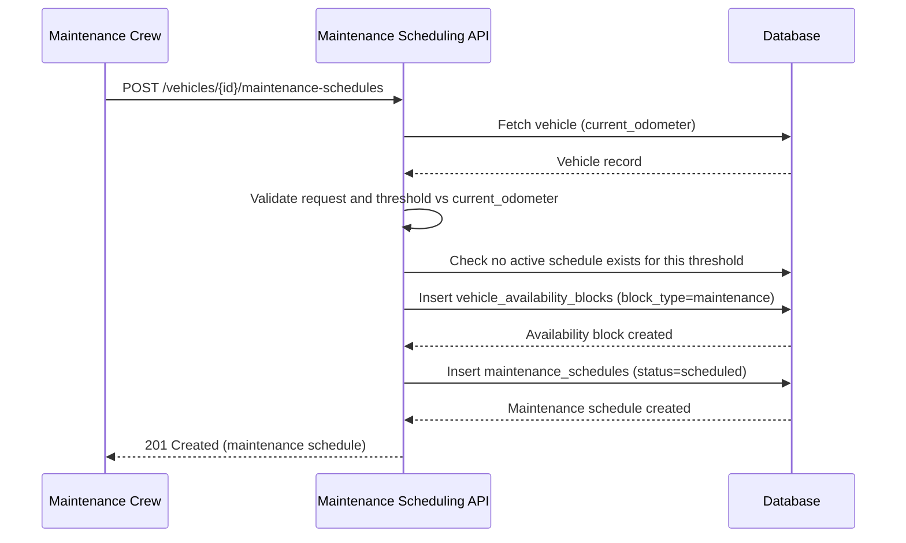

# TRD - Maintenance & Service Scheduling

## Document Information
- Feature Name: Maintenance & Service Scheduling
- Author: copilot
- Date:
- Version:

## Table of Contents
- [Background](#background)
- [In Scope](#in-scope)
- [Constraints](#constraints)
- [Technical Requirements](#technical-requirements)
  - [Database Design](#database-design)
  - [Frontend](#frontend)
  - [Backend](#backend)
- [Security Requirement](#security-requirement)
- [Non-Functional Requirements](#non-functional-requirements)
- [AI usage disclaimer](#ai-usage-disclaimer)

## Background
This TRD implements the [Maintenance & Service Scheduling](https://github.com/timpamungkas/ai-sdlc/blob/main/docs/prd/prd-car-management.md#7-maintenance--service-scheduling) functional requirement defined in the [PRD - Car Management](../prd/prd-car-management.md). That requirement states maintenance is scheduled every 10,000-12,000 kilometers, with the crew setting a maintenance date at each 10,000 km multiple threshold. Maintenance takes priority over reservations: once scheduled, it automatically blocks the vehicle's availability for the scheduled day(s), and a vehicle with a maintenance-day conflict is excluded from reservation allocation in favor of maintenance.

## In Scope
- Capturing and persisting a maintenance schedule for a vehicle: the 10,000 km threshold reached, the odometer reading at the time of scheduling, and the scheduled maintenance day(s) (start and end date).
- Validating that a maintenance schedule can only be created once the vehicle's current odometer reading has reached the relevant 10,000 km multiple.
- Automatically creating a vehicle availability block for the scheduled maintenance day(s) so the vehicle is marked unavailable for that period.
- Ensuring maintenance blocks take priority over reservations: a vehicle with an overlapping scheduled maintenance day is excluded from reservation allocation for that day.
- Allowing the maintenance crew to mark a scheduled maintenance entry as completed or cancelled, releasing the associated availability block when cancelled.
- REST API contract for creating, retrieving, completing, and cancelling a maintenance schedule.
- Data design required to record maintenance schedules and their relationship to vehicle availability.

## Constraints
- Automated detection of when a vehicle's odometer reaches a 10,000 km multiple (e.g., via telemetry or check-in mileage capture) is out of scope; this TRD assumes the vehicle's `current_odometer` value is already available and is only read, not populated, by this feature. Vehicle Status & Telemetry and Return & Check-in Inspection (which would keep `current_odometer` up to date) are separate PRD items and out of scope here.
- Reservation allocation logic itself (matching a reservation to a vehicle) is out of scope; this TRD only ensures the candidate pool used by allocation excludes vehicles with an overlapping maintenance block, per the [Reservation Allocation TRD](./trd-reservation-allocation.md).
- Computation and rendering of real-time/planned vehicle availability views are out of scope; this TRD only produces the maintenance-type availability block records consumed by the [Car Management: Location & Inventory Management TRD](./trd-car-management-location-inventory.md).
- Maintenance work order details (e.g., parts used, labor cost, service provider) are not covered; only the scheduling window and its effect on availability are in scope.
- Cleaning & turnaround blocking (the standard 1-day post-return block) is out of scope and covered by a separate Cleaning & Turnaround TRD.

## Technical Requirements

### Database Design
The following tables are required for this feature. Table definitions are documented in [Database Design - Maintenance & Service Scheduling](./database-design-maintenance-service-scheduling.md):
- `maintenance_schedules`

This feature references two tables owned by other TRDs:
- `vehicles` — canonical definition in [Database Design - Vehicle Onboarding](./database-design-vehicle-onboarding.md), consolidated across the Vehicle Onboarding, Location & Inventory Management, Reservation Allocation, and Maintenance & Service Scheduling TRDs. This TRD reads `current_odometer` to validate scheduling thresholds.
- `vehicle_availability_blocks` — defined in [Database Design - Car Management: Location & Inventory Management](./database-design-car-management-location-inventory.md). This TRD creates and removes `block_type = 'maintenance'` entries in this table.

### Frontend
- The maintenance scheduling form must validate that the entered threshold is a 10,000 km multiple not exceeding the vehicle's current odometer reading, and must display an inline, field-level error message when it is not.
- The form must require both a scheduled start date and end date, and must display an inline error if the end date precedes the start date.
- The maintenance schedule list/detail view must clearly indicate status (scheduled, completed, cancelled) and, for scheduled entries, must visually flag any overlap with an existing pending reservation for the same vehicle.
- The UI must be responsive and usable on both desktop and tablet form factors, since maintenance crews may use handheld devices in the field.

### Backend
Maintenance scheduling is exposed via a REST API.

#### API: Create a maintenance schedule
- **Method / URL:** `POST /api/v1/vehicles/{vehicleId}/maintenance-schedules`
- **Path Parameter:** `vehicleId` (string, UUID) - the vehicle to schedule maintenance for.
- **Request Body:**
  | Field | Type | Required | Notes |
  | --- | --- | --- | --- |
  | thresholdKm | integer | yes | Must be a positive multiple of 10,000 and must not exceed the vehicle's `current_odometer`. |
  | scheduledStartDate | date (ISO 8601) | yes | Must not be in the past. |
  | scheduledEndDate | date (ISO 8601) | yes | Must be on or after `scheduledStartDate`. |
- **Response Body (201 Created):**
  | Field | Type | Notes |
  | --- | --- | --- |
  | id | string (UUID) | |
  | vehicleId | string (UUID) | |
  | thresholdKm | integer | |
  | odometerAtScheduling | integer | Snapshot of `current_odometer` at creation time. |
  | scheduledStartDate | date | |
  | scheduledEndDate | date | |
  | status | enum | Always "scheduled" on creation. |
  | availabilityBlockId | string (UUID) | Identifier of the `vehicle_availability_blocks` entry created for this schedule. |
- **Error Responses:**
  - `400 Bad Request` when a required field is missing or fails validation; response body lists each invalid/missing field and the reason.
  - `404 Not Found` when `vehicleId` does not exist.
  - `409 Conflict` when the vehicle already has a non-cancelled maintenance schedule for the same `thresholdKm`.
  - `422 Unprocessable Entity` when `thresholdKm` exceeds the vehicle's `current_odometer`.

#### API: Get maintenance schedules for a vehicle
- **Method / URL:** `GET /api/v1/vehicles/{vehicleId}/maintenance-schedules`
- **Path Parameter:** `vehicleId` (string, UUID).
- **Query Parameters:** `status` (optional, enum: scheduled, completed, cancelled), `page`, `pageSize` (optional, for pagination).
- **Response Body (200 OK):** a paginated list of maintenance schedule entries, each with the same fields as the create-response body.

#### API: Complete a maintenance schedule
- **Method / URL:** `PATCH /api/v1/maintenance-schedules/{maintenanceScheduleId}/complete`
- **Path Parameter:** `maintenanceScheduleId` (string, UUID).
- **Response Body (200 OK):**
  | Field | Type | Notes |
  | --- | --- | --- |
  | id | string (UUID) | |
  | status | enum | Always "completed". |
  | completedAt | timestamp | |
- **Error Responses:**
  - `404 Not Found` when `maintenanceScheduleId` does not exist.
  - `422 Unprocessable Entity` when the schedule is not currently in "scheduled" status.

#### API: Cancel a maintenance schedule
- **Method / URL:** `PATCH /api/v1/maintenance-schedules/{maintenanceScheduleId}/cancel`
- **Path Parameter:** `maintenanceScheduleId` (string, UUID).
- **Response Body (200 OK):**
  | Field | Type | Notes |
  | --- | --- | --- |
  | id | string (UUID) | |
  | status | enum | Always "cancelled". |
- **Error Responses:**
  - `404 Not Found` when `maintenanceScheduleId` does not exist.
  - `422 Unprocessable Entity` when the schedule is not currently in "scheduled" status (i.e., already "completed" or "cancelled").

#### Common Validation
- `vehicleId`, `maintenanceScheduleId`: must be a valid UUID (regex: `^[0-9a-fA-F]{8}-[0-9a-fA-F]{4}-[0-9a-fA-F]{4}-[0-9a-fA-F]{4}-[0-9a-fA-F]{12}$`) and must reference an existing, non-deleted record.
- `thresholdKm`: positive integer, must satisfy `thresholdKm % 10000 == 0`.
- `scheduledStartDate`, `scheduledEndDate`: valid ISO 8601 dates (`YYYY-MM-DD`); `scheduledEndDate` must not be earlier than `scheduledStartDate`.

#### Algorithm - Create Maintenance Schedule
```
1. Receive create-maintenance-schedule request for vehicleId.
2. Look up the vehicle by vehicleId.
   - If not found, return 404.
3. Validate all required fields are present and match common validation rules.
   - If validation fails, return 400 with the list of invalid/missing fields.
4. Check that thresholdKm <= vehicle.current_odometer.
   - If not, return 422 Unprocessable Entity.
5. Check that no non-cancelled maintenance schedule already exists for (vehicleId, thresholdKm).
   - If one exists, return 409 Conflict.
6. Create a vehicle_availability_blocks entry:
   - block_type = "maintenance"
   - vehicle_id = vehicleId
   - start_at = scheduledStartDate (start of day)
   - end_at = scheduledEndDate (end of day)
7. Persist a new maintenance_schedules record with:
   - status = "scheduled"
   - odometer_at_scheduling = vehicle.current_odometer
   - availability_block_id = the block created in step 6
   - all submitted scheduling fields
8. Return 201 Created with the persisted maintenance schedule record.
```

#### Algorithm - Complete / Cancel Maintenance Schedule
```
1. Receive complete/cancel request for maintenanceScheduleId.
2. Look up the maintenance schedule by maintenanceScheduleId.
   - If not found, return 404.
3. If completing: verify current status is "scheduled"; if not, return 422.
   If cancelling: verify current status is "scheduled" (not already "completed" or "cancelled"); if not, return 422.
4. If cancelling: soft-delete the associated vehicle_availability_blocks entry
   (referenced by availability_block_id) so the vehicle is no longer blocked,
   and clear availability_block_id.
5. Update the maintenance schedule's status ("completed" or "cancelled") and,
   for completion, set completed_at to now().
6. Return 200 OK with the updated maintenance schedule status.
```



Maintenance priority over reservations is enforced by the [Reservation Allocation TRD](./trd-reservation-allocation.md#allocation-algorithm)'s candidate-vehicle query, which excludes any vehicle with an overlapping, non-cancelled `vehicle_availability_blocks` entry — including the `block_type = 'maintenance'` entries created here — for the requested reservation window.

## Security Requirement
- All maintenance scheduling endpoints must require authentication via JWT (RS256 signing algorithm) issued by the company's identity provider.
- The JWT payload must include the authenticated staff member's user ID, role (must include the "Maintenance Crew" or "Fleet Operations" claim), token issuer, and expiry (`exp`) claims.
- Requests without a valid, non-expired token must be rejected with `401 Unauthorized`.
- Requests from an authenticated user lacking the required role claim must be rejected with `403 Forbidden`.
- All requests and responses must be transmitted over HTTPS/TLS.
- All maintenance schedule create/complete/cancel actions must retain `created_by` and `updated_by` populated from the authenticated user's identity for audit purposes.

## Non-Functional Requirements

## AI usage disclaimer
*This document was generated with the assistance of artificial intelligence and should be reviewed by a human for accuracy and completeness.*
