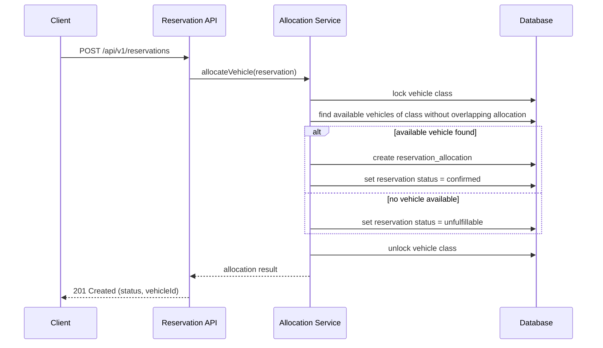

# TRD - Reservation Allocation

## Document Information
- Feature Name: Reservation Allocation
- Author: Copilot
- Date:
- Version:

## Table of Contents
- [Background](#background)
- [In Scope](#in-scope)
- [Constraints](#constraints)
- [Technical Requirements](#technical-requirements)
- [Security Requirement](#security-requirement)
- [Non-Functional Requirements](#non-functional-requirements)
- [AI usage disclaimer](#ai-usage-disclaimer)

## Background
This TRD implements the [Reservation Allocation](../prd/prd-car-management.md#3-reservation-allocation) functional requirement defined in the [PRD - Car Management](../prd/prd-car-management.md). The requirement is: when a reservation is made, a vehicle must be automatically allocated to it using a first-come-first-served approach, with no prioritization rules and no overbooking. If no available vehicle of the requested class exists at the requested time, the reservation is flagged as unfulfillable instead of being allocated.

## In Scope
- Automatic allocation of a single available vehicle to a confirmed reservation at the moment the reservation is made.
- First-come-first-served allocation ordering based on the reservation request timestamp, with no exact-model or other prioritization rules.
- Prevention of overbooking: a vehicle can never be allocated to two reservations with overlapping time ranges.
- Marking a reservation as unfulfillable when no available vehicle of the requested class exists for the requested time range.
- REST API for submitting a reservation and triggering allocation, and for querying the allocation result of a reservation.
- Data model for vehicles, vehicle classes, reservations, and reservation allocations.

## Constraints
- Vehicle onboarding, location/inventory management, and vehicle availability calculation (real-time and planned) are covered by other TRDs and are only referenced here as dependencies.
- Manual/staff-initiated reallocation, vehicle swaps, and substitutions are out of scope (covered by the "Vehicle Swaps & Substitutions" functional requirement).
- Extensions and early returns of existing reservations are out of scope (covered by the "Extensions & Early Returns" functional requirement).
- Pricing, billing, and payment processing for reservations are out of scope.
- Notification delivery (email/SMS/dashboard) when a reservation is marked unfulfillable is out of scope (covered by the "Alerts & Notifications" functional requirement).

## Technical Requirements

### Database Design
The following tables are required for this feature. Table field definitions are documented in [database-design-reservation-allocation.md](./database-design-reservation-allocation.md):
- `vehicle_classes`
- `vehicles`
- `reservations`
- `reservation_allocations`

### Backend
Allocation is exposed as a REST API. GRPC/GraphQL are not required since this is a request/response operation with no streaming needs.

#### API Specification

**Create a reservation and trigger allocation**
- Method: `POST`
- URL: `/api/v1/reservations`
- Request body:
  ```json
  {
    "vehicleClassId": "string (uuid)",
    "startAt": "string (ISO 8601 date-time)",
    "endAt": "string (ISO 8601 date-time)"
  }
  ```
- Response body (`201 Created`):
  ```json
  {
    "reservationId": "string (uuid)",
    "status": "confirmed | unfulfillable",
    "vehicleId": "string (uuid, null if unfulfillable)",
    "allocatedAt": "string (ISO 8601 date-time, null if unfulfillable)"
  }
  ```

**Get the allocation result for a reservation**
- Method: `GET`
- URL: `/api/v1/reservations/{reservationId}/allocation`
- Path parameter: `reservationId` (uuid, required)
- Response body (`200 OK`):
  ```json
  {
    "reservationId": "string (uuid)",
    "status": "confirmed | unfulfillable",
    "vehicleId": "string (uuid, null if unfulfillable)",
    "allocatedAt": "string (ISO 8601 date-time, null if unfulfillable)"
  }
  ```
- Response (`404 Not Found`): returned when `reservationId` does not exist.

#### Common Validation
- `vehicleClassId`: required, must be a valid UUID that references an existing, non-deleted vehicle class.
- `startAt`, `endAt`: required, ISO 8601 date-time strings; `endAt` must be strictly after `startAt`; `startAt` must not be in the past.
- `reservationId`: required, must be a valid UUID.

#### Allocation Algorithm
Allocation runs synchronously as part of reservation creation, within a single transaction/lock scope per vehicle class to avoid race conditions between concurrent requests for the same class and time range.

Pseudocode:
```
function allocateVehicle(reservation):
    lock(reservation.vehicleClassId)  // serialize allocation per vehicle class
    candidates = findVehicles(
        vehicleClassId = reservation.vehicleClassId,
        status = "available"
    )
    // exclude vehicles already allocated to an overlapping, non-cancelled reservation
    candidates = filter(candidates, vehicle ->
        not existsOverlappingAllocation(vehicle, reservation.startAt, reservation.endAt)
    )

    if candidates is empty:
        reservation.status = "unfulfillable"
        save(reservation)
        unlock(reservation.vehicleClassId)
        return reservation

    selectedVehicle = candidates[0]  // first available match; no prioritization rules
    allocation = createReservationAllocation(
        reservationId = reservation.id,
        vehicleId = selectedVehicle.id,
        allocatedAt = now()
    )
    reservation.status = "confirmed"
    save(reservation)
    save(allocation)
    unlock(reservation.vehicleClassId)
    return reservation
```

Sequence diagram:


Ordering guarantee: requests are processed for allocation in ascending order of `requested_at` (the timestamp the reservation request was received), ensuring first-come-first-served behavior when two reservations compete for the same class and overlapping time window.

## Security Requirement
- All endpoints require authentication via a bearer JWT token signed with RS256, issued by the platform's identity provider.
- The JWT payload must include `sub` (caller identifier), `roles`, `iat`, and `exp` claims; tokens are rejected if expired or if the signature cannot be verified against the identity provider's published public key.
- Only callers with a role permitting reservation creation (e.g., `reservation:write`) may call `POST /api/v1/reservations`; callers with `reservation:read` may call the `GET` allocation endpoint.
- All API traffic must be served over TLS.

## Non-Functional Requirements


## AI usage disclaimer
*This document was generated with the assistance of artificial intelligence and should be reviewed by a human for accuracy and completeness.*
