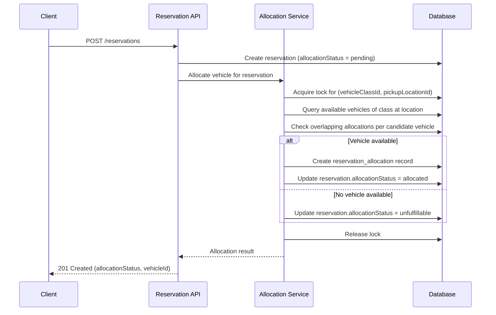

# TRD - Reservation Allocation

## Document Information
- Feature Name: Reservation Allocation 
- Author: Copilot
- Date:
- Version:

## Table of Contents
- [TRD - Reservation Allocation](#trd---reservation-allocation)
  - [Document Information](#document-information)
  - [Table of Contents](#table-of-contents)
  - [Background](#background)
  - [In Scope](#in-scope)
  - [Constraints](#constraints)
  - [Technical Requirements](#technical-requirements)
    - [Database Design](#database-design)
    - [Backend](#backend)
      - [API Specification](#api-specification)
      - [Common Validation](#common-validation)
      - [Allocation Algorithm](#allocation-algorithm)
  - [Security Requirement](#security-requirement)
  - [Non-Functional Requirements](#non-functional-requirements)
  - [AI usage disclaimer](#ai-usage-disclaimer)

## Background
This TRD implements the functional requirement **[3. Reservation Allocation](../prd/prd-car-management.md#3-reservation-allocation)** defined in the [PRD - Car Management](../prd/prd-car-management.md).

The requirement states that a vehicle must be automatically allocated to a reservation using a first-come-first-served approach, with no prioritization rules and no overbooking.

## In Scope
- Automatic allocation of a single available vehicle to a reservation at the moment the reservation is confirmed.
- First-come-first-served allocation logic based on reservation confirmation order, with no prioritization rules (e.g., no exact-model guarantee over class guarantee).
- Preventing overbooking by ensuring a vehicle can only be allocated to one confirmed reservation for overlapping time windows.
- Marking a reservation as unfulfillable when no available vehicle of the requested class exists for the requested time window.
- Data design required to record allocation decisions and their outcomes.

## Constraints
- Vehicle onboarding, vehicle status/telemetry updates, and location/inventory management are out of scope and are covered by their respective TRDs.
- Manual or staff-initiated vehicle assignment/override is out of scope.
- Vehicle swaps, substitutions, extensions, and early returns (which may change an existing allocation) are out of scope and covered by the Vehicle Swaps & Substitutions and Extensions & Early Returns TRDs.
- Pricing, discounts, and payment processing are out of scope.
- Notification of the customer/staff about allocation outcomes is out of scope and covered by the Alerts & Notifications TRD.

## Technical Requirements

### Database Design
The following tables are required for this feature:
- `vehicle_classes`, `reservations`, `reservation_allocations` — defined in [Database Design - Reservation Allocation](./database-design-reservation-allocation.md).
- `vehicles` — canonical definition in [Database Design - Vehicle Onboarding](./database-design-vehicle-onboarding.md), consolidated across the Vehicle Onboarding, Location & Inventory Management, Reservation Allocation, and Maintenance & Service Scheduling TRDs.

### Backend
Allocation is exposed as a REST API. GRPC/GraphQL are not required since the interaction is a simple synchronous request/response.

#### API Specification

**1. Create Reservation (triggers allocation)**
- **Method:** `POST`
- **URL:** `/api/v1/reservations`
- **Request Body:**
  ```json
  {
    "vehicleClassId": "string (UUID)",
    "pickupLocationId": "string (UUID)",
    "pickupDatetime": "string (ISO 8601 date-time)",
    "returnDatetime": "string (ISO 8601 date-time)"
  }
  ```
- **Response Body (201 Created, allocated):**
  ```json
  {
    "reservationId": "string (UUID)",
    "allocationStatus": "allocated",
    "vehicleId": "string (UUID)"
  }
  ```
- **Response Body (201 Created, unfulfillable):**
  ```json
  {
    "reservationId": "string (UUID)",
    "allocationStatus": "unfulfillable",
    "vehicleId": null
  }
  ```

**2. Get Reservation Allocation Status**
- **Method:** `GET`
- **URL:** `/api/v1/reservations/{reservationId}`
- **Path Parameter:** `reservationId` (UUID) - identifier of the reservation
- **Response Body (200 OK):**
  ```json
  {
    "reservationId": "string (UUID)",
    "vehicleClassId": "string (UUID)",
    "pickupLocationId": "string (UUID)",
    "pickupDatetime": "string (ISO 8601 date-time)",
    "returnDatetime": "string (ISO 8601 date-time)",
    "allocationStatus": "pending | allocated | unfulfillable",
    "vehicleId": "string (UUID) | null"
  }
  ```

#### Common Validation
- `vehicleClassId`, `pickupLocationId`: must be a valid UUID (regex: `^[0-9a-fA-F]{8}-[0-9a-fA-F]{4}-[0-9a-fA-F]{4}-[0-9a-fA-F]{4}-[0-9a-fA-F]{12}$`) and must reference an existing, non-deleted record.
- `pickupDatetime`, `returnDatetime`: must be valid ISO 8601 date-time strings; `returnDatetime` must be strictly after `pickupDatetime`; `pickupDatetime` must not be in the past.
- `reservationId`: must be a valid UUID and must reference an existing reservation, otherwise return `404 Not Found`.

#### Allocation Algorithm
Allocation is executed synchronously when a reservation is created, using the following pseudocode:

```
function allocateVehicle(reservation):
    lock(reservation.vehicleClassId, reservation.pickupLocationId)  // prevent race conditions between concurrent requests
    candidateVehicles = findVehicles(
        vehicleClassId = reservation.vehicleClassId,
        locationId = reservation.pickupLocationId,
        status = "Active"  // merged vehicle lifecycle status (see database-design-reservation-allocation.md)
    )

    availableVehicle = null
    for vehicle in candidateVehicles (ordered by vehicle.created_at ascending):
        if not hasOverlappingAllocation(vehicle, reservation.pickupDatetime, reservation.returnDatetime):
            availableVehicle = vehicle
            break

    if availableVehicle is not null:
        createAllocation(reservation.id, availableVehicle.id, now())
        reservation.allocationStatus = "allocated"
    else:
        reservation.allocationStatus = "unfulfillable"

    unlock(reservation.vehicleClassId, reservation.pickupLocationId)
    return reservation
```

The `lock`/`unlock` steps ensure that when two reservations request the same vehicle class and location at overlapping times, they are processed sequentially (first-come-first-served) so that no vehicle is allocated to more than one overlapping reservation (no overbooking).



## Security Requirement
- All endpoints require an authenticated request using a JWT bearer token validated using the RS256 algorithm.
- The JWT payload must contain at minimum: `sub` (user/system identifier), `role` (caller's role, e.g., `reservation-system`), `iat`, and `exp`.
- Only callers with the `reservation-system` or `staff` role are authorized to create reservations; the token's `role` claim is validated on every request.
- All inputs must be validated and sanitized server-side before being used in database queries to prevent injection attacks, regardless of any client-side validation.

## Non-Functional Requirements


## AI usage disclaimer
*This document was generated with the assistance of artificial intelligence and should be reviewed by a human for accuracy and completeness.*
