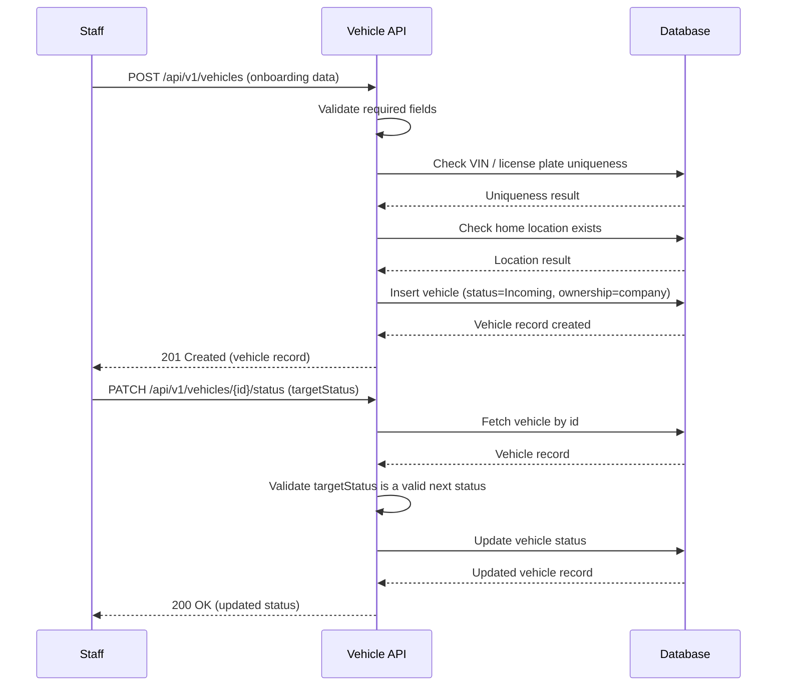

# TRD - Vehicle Onboarding

## Document Information
- Feature Name: Vehicle Onboarding
- Author: copilot
- Date:
- Version:

## Table of Contents
- [Background](#background)
- [In Scope](#in-scope)
- [Constraints](#constraints)
- [Technical Requirements](#technical-requirements)
- [Security Requirement](#security-requirement)
- [Non-Functional Requirements](#non-functional-requirements)
- [AI usage disclaimer](#ai-usage-disclaimer)

## Background
This TRD implements the [Vehicle Onboarding](https://github.com/timpamungkas/ai-sdlc/blob/main/docs/prd/prd-car-management.md#1-vehicle-onboarding) functional requirement defined in the [PRD - Car Management](../prd/prd-car-management.md). That requirement covers two user stories:
- Registering a new vehicle into the fleet with its identifying, ownership, and classification data.
- Managing the vehicle lifecycle status (Incoming, Active, Maintenance, Decommissioning, Sold) as staff manually transition a vehicle between stages.

## In Scope
- Capturing and persisting vehicle onboarding data: VIN, license plate, purchase date, purchase cost, insurance details (policy number, expiry date), odometer reading, vehicle type (brand, model, manufacturing year), size, class, number of seats, fuel type, and ownership.
- Validating that required onboarding fields are present before a vehicle record is created.
- Assigning an initial lifecycle status ("Incoming") and a home location reference to a newly onboarded vehicle.
- Manual, staff-triggered transitions between lifecycle statuses: Incoming → Active; Active → Maintenance; Maintenance → Active; Active → Decommissioning; Decommissioning → Sold.
- Defaulting and enforcing that ownership is always the company for every vehicle record.
- REST API contract for creating a vehicle and for transitioning its lifecycle status.

## Constraints
- Detailed location and inventory management (e.g., transfers between locations, capacity tracking) is out of scope; this TRD only stores a reference to the vehicle's home location as described in [Location & Inventory Management](../prd/prd-car-management.md#2-location--inventory-management).
- Automatic, rule-based lifecycle transitions (e.g., triggered by age, mileage, or depreciation) are out of scope; all transitions are manually triggered by staff.
- Reservation allocation, telemetry, pickup/delivery, maintenance scheduling, and other lifecycle stages described elsewhere in the PRD are out of scope for this TRD.
- Vehicle disposal/sale financial processing (e.g., accounting entries) is out of scope.

## Technical Requirements

### Database Design
A list of tables required to support Vehicle Onboarding is defined in [Database Design - Vehicle Onboarding](./database-design-vehicle-onboarding.md).

### Frontend
- The vehicle onboarding form must validate all required fields client-side before submission and must display inline, field-level error messages for any missing or invalid field.
- The form must present the lifecycle status as read-only during onboarding (always defaults to "Incoming") and must offer an explicit, separate action for staff to transition status afterward.
- The lifecycle status transition control must only present the statuses that are valid next steps from the vehicle's current status (Incoming → Active; Active → Maintenance or Decommissioning; Maintenance → Active; Decommissioning → Sold), and must not allow skipping ahead to a non-adjacent status.
- The UI must be responsive and usable on both desktop and tablet form factors, since pickup/delivery and maintenance crews may use handheld devices in the field.
- Ownership must be displayed as a read-only field, always showing the company as owner.

### Backend
- Expose vehicle onboarding and lifecycle transition capability through a REST API.

**Create Vehicle**
- Method: `POST`
- URL: `/api/v1/vehicles`
- Request Body:
  | Field | Type | Required | Notes |
  | --- | --- | --- | --- |
  | vin | string | yes | Unique. |
  | licensePlate | string | yes | Unique. |
  | purchaseDate | date (ISO 8601) | yes | |
  | purchaseCost | decimal | yes | Must be greater than 0. |
  | insurancePolicyNumber | string | yes | |
  | insuranceExpiryDate | date (ISO 8601) | yes | Must be a future date. |
  | odometerReading | integer | yes | Must be >= 0. |
  | brand | string | yes | |
  | model | string | yes | |
  | manufacturingYear | integer | yes | |
  | size | enum (small, medium) | yes | Only "small" and "medium" are supported in this phase, per the PRD's current vehicle size classification. |
  | class | enum (economy, luxury) | yes | |
  | seats | integer | yes | Must be > 0. |
  | fuelType | enum (gas, electric, hybrid) | yes | |
  | homeLocationId | string (UUID) | yes | Must reference an existing location. |
- Response Body (201 Created):
  | Field | Type | Notes |
  | --- | --- | --- |
  | id | string (UUID) | |
  | status | enum | Always "Incoming" on creation. |
  | ownership | string | Always the company. |
  | ...(all request fields echoed back) | | |
- Error Responses:
  - `400 Bad Request` when a required field is missing or fails validation; response body lists each invalid/missing field and the reason.
  - `409 Conflict` when the VIN or license plate already exists.
  - `422 Unprocessable Entity` when `homeLocationId` is a syntactically valid identifier but does not reference an existing location; response body identifies `homeLocationId` as the failing field.

**Transition Vehicle Lifecycle Status**
- Method: `PATCH`
- URL: `/api/v1/vehicles/{vehicleId}/status`
- Path Parameter: `vehicleId` (string, UUID) - identifier of the vehicle.
- Request Body:
  | Field | Type | Required | Notes |
  | --- | --- | --- | --- |
  | targetStatus | enum (Active, Maintenance, Decommissioning, Sold) | yes | Must be the next valid status in the lifecycle sequence relative to the vehicle's current status. "Incoming" is never a valid target, as a vehicle cannot transition back to it. |
- Response Body (200 OK):
  | Field | Type | Notes |
  | --- | --- | --- |
  | id | string (UUID) | |
  | status | enum | The new, updated status. |
  | updatedAt | timestamp | |
- Error Responses:
  - `422 Unprocessable Entity` when `targetStatus` is a syntactically valid enum value but is not a valid next status from the vehicle's current status.
  - `404 Not Found` when `vehicleId` does not exist.

**Common Validation**
- `vin`: alphanumeric, exactly 17 characters, matching pattern `^[A-HJ-NPR-Z0-9]{17}$` (excludes I, O, Q as per standard VIN format).
- `licensePlate`: alphanumeric string, 1-15 characters.
- `purchaseDate`, `insuranceExpiryDate`: ISO 8601 date format (`YYYY-MM-DD`).
- `purchaseCost`: decimal, precision 15, scale 2, greater than 0.
- `odometerReading`, `seats`: non-negative integers, `seats` must be greater than 0.
- `manufacturingYear`: 4-digit integer between 1900 and the current calendar year at the time of the request (inclusive).
- `size`, `class`, `fuelType`, `status`: must match one of the predefined enum values; any other value is rejected.

**Algorithm - Create Vehicle**
```
1. Receive create-vehicle request.
2. Validate all required fields are present and match common validation rules.
   - If validation fails, return 400 with the list of invalid/missing fields.
3. Check that VIN and license plate do not already exist.
   - If either already exists, return 409 Conflict.
4. Check that homeLocationId references an existing location.
   - If not found, return 422 Unprocessable Entity identifying homeLocationId as the failing field.
5. Persist a new vehicle record with:
   - status = "Incoming"
   - ownership = the company (fixed value)
   - all submitted onboarding fields
6. Return 201 Created with the persisted vehicle record.
```

**Algorithm - Transition Vehicle Lifecycle Status**
```
1. Receive status-transition request for vehicleId.
2. Look up the vehicle by vehicleId.
   - If not found, return 404.
3. Determine the set of valid next statuses for the vehicle's current status
   (Incoming -> Active, Active -> Maintenance, Active -> Decommissioning,
    Maintenance -> Active, Decommissioning -> Sold). "Maintenance -> Active"
    is the only transition allowed to move back to a previously-held status,
    since a vehicle returns to service once maintenance is complete; no
    other status may transition back to a previous one, and non-adjacent
    statuses (e.g., Incoming -> Sold) may never be skipped to directly.
4. If targetStatus is not in the valid next statuses, return 422 Unprocessable Entity.
5. Update the vehicle's status to targetStatus and record updatedAt/updatedBy.
6. Return 200 OK with the updated vehicle status.
```



## Security Requirement
- All vehicle onboarding and status transition endpoints must require authentication via JWT (RS256 signing algorithm) issued by the company's identity provider.
- The JWT payload must include the authenticated staff member's user ID, role (must include the "Car Management Role" or "Fleet Operations" claim), token issuer, and expiry (`exp`) claims.
- Requests without a valid, non-expired token must be rejected with `401 Unauthorized`.
- Requests from an authenticated user lacking the required role claim must be rejected with `403 Forbidden`.
- All requests and responses must be transmitted over HTTPS/TLS.
- Sensitive fields (e.g., insurance policy number) must be encrypted at rest.

## Non-Functional Requirements

## AI usage disclaimer
*This document was generated with the assistance of artificial intelligence and should be reviewed by a human for accuracy and completeness.*
